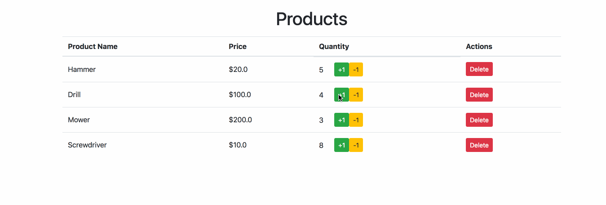

**Carefully read all the instructions before beginning the assessment.**

# Java III Assessment

For this assessment, your task will be to take an existing application and
implement a new feature in it.

You are given an application that tracks products. A product has a name and a
price.

The application currently has the following features:

- Show existing products
- Add new products
- Delete products

Your task is to add item quantity tracking to the application, specifically, the
ability to:

- track product quantity in the database
- specify quantity when creating a product
- View product quantity
- Add and subtract from the product quantity

This will assess both your understanding of MySQL and the Java III sections.

## Setup

0. Clone this repository and open it in IntelliJ
1. Create and do your work in a branch named `first-last` where `first` and
   `last` are your first name and last name
1. Run the migration and the seeder sql scripts located in `src/main/sql` (the
   migration will create a database for you, so you won't need to worry about
   creating it yourself). This will create a database named `products_db` and
   put some test data in it. You may wish to inspect the database structure.
1. Configure IntelliJ
    - Mark the `src` directory as the sources root
    - Set the project SDK (File -> Project Structure) Choose either java 1.8 or
      java 9. For the purposes of this assessment, it does not matter which you
      choose.
1. Setup the Tomcat Run Configuration
    - Run -> Run... -> Edit Configurations...
    - Create a new configuration (Click the `+`) and choose Tomcat Server -> Local
    - Name the server "Java Assessment Server"
    - For "Application Server", choose the version of Tomcat you already have
      setup (this should already be selected by default if you setup tomcat
      correctly for the adlister project).
	- IntelliJ Should display a warning at the bottom of the dialog window that
      says "No artifacts marked for deployment". Click the "Fix" button and
      choose the war exploded.
	- Click the "Run" button and the application should startup
    - You can also reference [the section in the curriculum on configuring a servlet application with Tomcat][tomcat-config].
1. (Optional) This project contains a class located at
   `src/main/java/com/codeup/adlister/dao/Config.java` that contains the
   database credentials. If your credentials are *not* `root` and `codeup`, you
   should modify this file. (*Normally you should not have database credentials
   inside your project, but for the purposes of this assessment, we'll do so to
   keep things simple.*)
1. (Optional) Setup a database connection in IntelliJ. This is not required, and
   you can accomplish everything you need to do with the mysql command line
   client.
1. (Optional) Depending of your database engine version you might need to change the JDBC connection dependency on your ```pom.xml``` file, find [here](https://mvnrepository.com/artifact/mysql/mysql-connector-java) all the versions of the JDBC connector, specially if you are working with ```MySQL 8``` this will be required.
1. (Optional) Read the section below on testing your application and follow the
   instructions.

You should now be all setup to run the application and make changes to it.

### Project Structure

The structure of this project is very similar to the adlister project we worked
through together in class. The only differences are:

- The migration and seeder are in `src/main/sql`
- There are some extra files related to testing the application, a handful that
  are in the root of the project (`run-tests`, `.env.sh`, `package.json`,
  `jest.config.js`), and more in the `src/test` directory. You should not modify
  these files, and, for the most part, you can ignore them.

Just like in the adlister, you will write your Java code in
`src/main/java/com/codeup` and `src/main/webapp` for the jsps and frontend
code. You will also need to modify the sql files in `src/main/sql`.

The seeder file located at `src/main/sql/seeder.sql` is used in the testing of
your application. You will be required to make changes to this file, and are
allowed to add items to it, but you should not remove the existing items, as
their presence will help grade your assessment.

## Instructions

1. Modify the database structure, add a column named `quantity` to the
   `products` table.

    This column should be an unsigned integer.

    You will need to modify the table definition in the migration script, as
    well as the sample data in the seeder, and re-run both of these scripts.

    Feel free to add to the data in the seeder, but do not remove any existing
    data, as this will be used to check your work.

    You should not remove any of the existing columns from the `products` table;
    only add the `quantity` column.

    **In order for your work to count, you must make changes to (and commit) the
    .sql files, that is, just making changes in the GUI in IntelliJ is
    insufficient.**

1. Update the model

    You will need to make changes to the `Product` model to reflect the changes
    made in the database. You should add an additional property, constructor,
    and getters and setters.

1. Update the product creation process

    - Add a quantity field to the product creation form
    - Specifically, you should add an `input` element with a name of `quantity`
      to the form
    - Modify the servlet that handles product creation to find the submitted
      `quantity` value.
    - Modify the DAO so that the quantity is added to the database when creating
      a new product
    - Test this by filling out the form to create a new product, entering a
      quantity, and submitting the form. Log into your database and ensure that
      the values you typed into the form are present in the `products` table,
      including the quantity value.

1. Display the quantity of each product

    - Modify the existing html: You should modify the html table in
      `products.jsp` that shows all the products and add a column for the
      quantity for each product.

1. Add buttons to increment and decrement the current quantity for a given product

    - You should add two buttons to each row in the table that shows the
      products, a plus button and a minus button. Here is an example:

    

    The point is to illustrate that each row contains both buttons, don't worry
    about the styling, focus on the functionality.

    - Give the button for adding 1 a class of `btn-increment` and the button for
      subtracting one a class of `btn-decrement`.

    - When clicked, each button should either increment or decrement the
      quantity for the product in that row.

    - After clicking the button, the user should be redirected to the same page,
      `/products`

    - You will probably need to write:

        - A New Servlet to handle the requests that come from the button presses
        - A new method on the DAO to handle updating the quantity in the database

## Demo

This is what the finished table should look like:



## Grading

Grades **will not** be based on the CSS or styling for your site. So long as the
functionality (i.e. the html and backend logic) is there, your site does not
need to match the example picture.

Grades will be given based on the following criteria:

- Is the database updated?
- Does the product creation process work?
- Is the quantity displayed on the html products table?
- Are there buttons to add and subtract from the quantity?

## Testing Your Work

An automated test suite will be used to help grade your work, and you can run
these tests while you are working on the assessment in order to check your work.

### Setup

1. The tests are setup to interact with your local database using the username
   `root` and the password `codeup`. If you need to use different credentials,
   modify the `.env.sh` file at the root of this project.

1. Install the dependencies.

    Run:

    ```
    npm install
    ```

    from the project root

### Running the Tests

1. Make sure the web application is started with IntelliJ and is running on port
   8080 (this is the default configuration, unless you changed something, this
   should be fine).

1. Run the following command from the root of your project:

    ```
    ./run-tests
    ```

    and inspect the output

    **Note that running this script _will_ re-migrate and seed your database.**

    The tests are broken up into two main groups: "Existing Functionality" and
    the "Quantity Feature". When you first run the tests, you should expect that
    all of the quantity feature tests will be failing, but all of the tests for
    the existing functionality should be passing.

    The test messages explain exactly what they are testing, and for tests that
    look at an individual page, the output will contain what page they are
    testing. If a test is failing, you should visit that page yourself in your
    browser to see what is going on.

    *If you are using node version >= 10, you may see a deprecation warning when
    running the tests, you can safely ignore this, it is due to [an underlying
    issue in the library used to talk to mysql][node-mysql-issue], and will be
    fixed in a future release.*

[node-mysql-issue]: https://github.com/mysqljs/mysql/issues/2003
[tomcat-config]: http://java.codeup.com/appendix/further-reading/java/intellij-tomcat-configuration/
